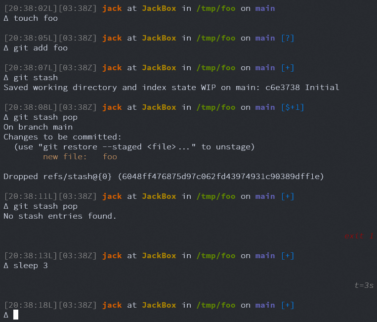

# Personal Dotfiles

Finally scrubbed this enough to put it publicly, although I've killed off all the git history since this used to have more privilege info that I have since removed.

It's a pretty vanilla setup, and will run gracefully on just about any Bash version but works best with some of the QOL and vi-mode features in Bash 4.4+.



* CLI goodness
    * `.bash_aliases` defines handy aliases and functions
    * `.bash_env` contains environment customization for bash and `PATH` management
        * Supplemented by `.inputrc` for direct Readline goodness
    * `.bash_prompt` for my customized prompts -- TL;DR command timing information, path/git status/etc. and error code output
    * `.bashrc_personal` is just a skeleton file that includes my other tools
* `.pack` and `.unpack`, scripts to move files out of the repo and into the local env and vice versa. `transporter.sh` bundles things for one way entry into ephemeral environments and assumes a `~/data` dir for it to make a home in.
* `.vimrc` even though I spend most of my day in VSCode, I still like to have vim work for quick edits

`qol` contains some quality of life files -- fonts, images, some helper scripts I use every now and again.

Quick provision:

```
curl -s https://raw.githubusercontent.com/jkingsman/dotfiles/refs/heads/main/qol/provision.sh | bash
```

Quick clone:

```
git clone https://github.com/jkingsman/dotfiles.git; cd dotfiles; ./.unpack; exec ${SHELL} -l;
```
